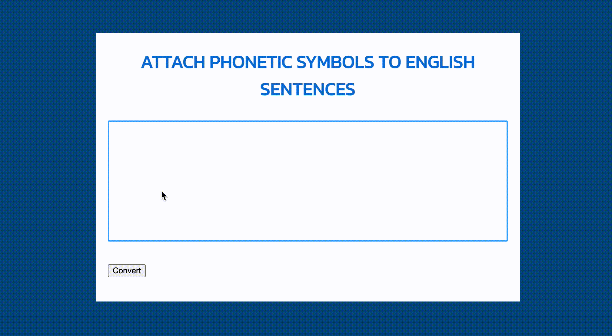

# phonetic-symbols-to-English-text

This program converts English text into the International Phonetic Alphabet (IPA) using the Pronouncing Dictionary published by Carnegie-Mellon University.

This project was based on the [mphilli/English-to-IPA](https://github.com/mphilli/English-to-IPA) project.

## Usage

It is available on the GitHub Page at https://t-cool.github.io/phonetic-symbols-to-English-text
Public .

Please paste the sentences you want to add phonetic symbols to and press the convert button. You can also click on each word to have it read aloud.

## License

MIT
